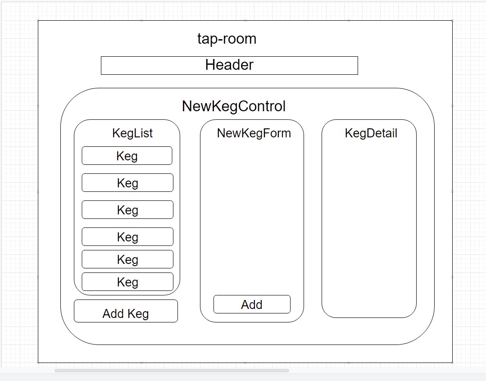

[![Contributors][contributors-shield]][contributors-url]
[![Forks][forks-shield]][forks-url]
[![Issues][issues-shield]][issues-url]
[![MIT License][license-shield]][license-url]
[![LinkedIn][linkedin-shield]][linkedin-url]


<!-- PROJECT LOGO -->
<br />
<p align="center">
  <a href="https://github.com/godfreyowidi/tap-room-react">
    
  </a>

  <h3 align="center">Tap Room</h3>

  <p align="center">
    This is a react project which enables a bar or a joint to track their kes. It displays a list of all available kegs with name, brand, proce and alcoholContent. The user can add new inventory of keg and also able to click and view details. The user is also able to increment and decrement keg inventory.
    <br />
    <a href="https://github.com/godfreyowidi/tap-room-react"><strong>Explore the docs »</strong></a>
    <br />
    <br />
    <a href="https://github.com/godfreyowidi/tap-room-react">View Demo</a>
    ·
    <a href="https://github.com/godfreyowidi/tap-room-react/issues">Report Bug</a>
    ·
    <a href="https://github.com/godfreyowidi/tap-room-react/issues">Request Feature</a>
  </p>
</p>


<!-- TABLE OF CONTENTS -->
<details open="open">
  <summary><h2 style="display: inline-block">Table of Contents</h2></summary>
  <ol>
    <li>
      <a href="#about-the-project">About The Project</a>
      <ul>
        <li><a href="#built-with">Built With</a></li>
      </ul>
    </li>
    <li>
      <a href="#getting-started">Getting Started</a>
      <ul>
        <li><a href="#prerequisites">Prerequisites</a></li>
        <li><a href="#installation">Installation</a></li>
      </ul>
    </li>
    <li><a href="#usage">Usage</a></li>
    <li><a href="#roadmap">Roadmap</a></li>
    <li><a href="#contributing">Contributing</a></li>
    <li><a href="#license">License</a></li>
    <li><a href="#contact">Contact</a></li>
    <li><a href="#acknowledgements">Acknowledgements</a></li>
  </ol>
</details>


### Built With

* [React](https://reactjs.org/)
* [Node](https://nodejs.org/en/)
* [Html & CSS](https://www.w3.org/standards/webdesign/htmlcss)


<!-- GETTING STARTED -->
## Getting Started

### Installation

To get a local copy up and running follow these simple steps.

* If you chose to clone via download:

Use the browser to navigate to GitHub page respository Click the Green Code button on the right and select Download Zip.

Alternatively clone from Github via the terminal using git clone command In your terminal, navigate to the directory where you would like to clone the project to.

Clone this repo to your chosen directory using this link https://github.com/godfreyowidi/tap-room-react in terminal.

* If you chose to download via zip:

Unzip the downloaded repository into your working directory

Open the working directory into your code editor using the command code .

Once you have the program open in your code editor, run ```npm install``` inside the production directory to set up the dependencies and tools for the project.

After the project is sucessfully set up, navigate to the directory in the terminal. Then execute the command ```npm start``` to start server

<!-- USAGE EXAMPLES -->
## Usage

Server is started on either :-

http://localhost:3000

http://localhost:3001

When the landing page displays, the user can add keg by clicking on the ```add keg``` button and be able to add the various properties of the keg.

The user can then view the keg details by clicking on the the the item and it will display the details.

The display page enables the user to ```edit``` and also be able to ```delete``` the item from the keg list.


<!-- ROADMAP -->
## Roadmap

See the [open issues](https://github.com/godfreyowidi/tap-room-react/issues) for a list of proposed features (and known issues).

<!-- CONTRIBUTING -->
## Contributing

Contributions are what make the open source community such an amazing place to learn, inspire, and create. Any contributions you make are **greatly appreciated**.

1. Fork the Project
2. Create your Feature Branch (`git checkout -b godfreyowidi/tap-room-react`)
3. Commit your Changes (`git commit -m 'Add some tap-room-react'`)
4. Push to the Branch (`git push origin godfreyowidi/tap-room-react`)
5. Open a Pull Request

<!-- LICENSE -->
## License

Distributed under the MIT License. See `LICENSE` for more information.

<!-- CONTACT -->
## Contact

Your Name - [@twitter_handle](https://twitter.com/godfreyowidi) - email

Project Link: [https://github.com/godfreyowidi/tap-room-react](https://github.com/godfreyowidi/tap-room-react)


<!-- ACKNOWLEDGEMENTS -->
## Acknowledgements

* [Epicodus](https://www.epicodus.com/)


<!-- MARKDOWN LINKS & IMAGES -->
<!-- https://www.markdownguide.org/basic-syntax/#reference-style-links -->
[contributors-shield]: https://img.shields.io/github/contributors/godfreyowidi/tap-room-react.svg?style=for-the-badge
[contributors-url]: https://gitHub.com/godfreyowidi/badges/graphs/contributors/
[forks-shield]: https://img.shields.io/github/forks/godfreyowidi/tap-room-react.svg?style=for-the-badge
[forks-url]: https://github.com/godfreyowidi/tap-room-react/network/members
[stars-shield]: https://img.shields.io/github/stars/godfreyowidi/tap-room-react.svg?style=for-the-badge
[stars-url]: https://github.com/github_username/repo_name/stargazers
[issues-url]: https://github.com/godfreyowidi/tap-room-react/issues
[issues-shield]: https://img.shields.io/github/issues/godfreyowidi/tap-room-react
[license-shield]: https://img.shields.io/badge/License-MIT-yellow.svg?style=for-the-badge
[license-url]: https://gist.github.com/lukas-h/2a5d00690736b4c3a7ba#the-mit-license
[linkedin-shield]: https://img.shields.io/badge/-LinkedIn-black.svg?style=for-the-badge&logo=linkedin&colorB=555
[linkedin-url]: https://linkedin.com/in/godfrey-owidi
